# Báo Cáo Bài Tập Lớn Môn Lập Trình Web
**Đề tài:** Phát triển ứng dụng nghe nhạc trực tuyến (PTIT Music)

---

## 1. Giới thiệu đề tài

**PTIT Music** là một ứng dụng nghe nhạc trực tuyến được xây dựng với đầy đủ các tính năng cơ bản của một nền tảng âm nhạc hiện đại, lấy cảm hứng từ giao diện của Spotify. Hệ thống được chia làm hai phần chính: Client-side UI/UX phục vụ trải nghiệm nghe nhạc của người dùng và Server-side API để xử lý nghiệp vụ, quản lý cơ sở dữ liệu.

**Mục tiêu của dự án:**
- Cung cấp trải nghiệm nghe nhạc mượt mà cho người dùng (User) với các tính năng như phát nhạc cơ bản, tìm kiếm, lưu trữ playlist cá nhân và bài hát yêu thích.
- Cung cấp giao diện quản trị (Admin Dashboard) để thống kê, quản lý người dùng, nghệ sĩ và bài hát (hỗ trợ upload bài hát bằng file upload).

### 1.1. Nền tảng kỹ thuật và công nghệ

Dự án **PTIT Music** được phát triển theo mô hình Client-Server với hệ thống API RESTful, phân tách rõ ràng giữa Frontend và Backend. Các công nghệ cốt lõi được sử dụng bao gồm:

**1.1.1. Frontend (Giao diện người dùng)**
Giao diện người dùng được xây dựng hoàn toàn bằng các công nghệ web cơ bản, không phụ thuộc vào framework nặng, nhằm đảm bảo hiệu năng và tốc độ tải trang nhanh nhất.
- **HTML5 & CSS3**: Xây dựng cấu trúc và định dạng giao diện. Ứng dụng phong cách thiết kế hiện đại (Modern Web Design), sử dụng bố cục linh hoạt (Flexbox/Grid) để đảm bảo tính phản hồi (Responsive) trên nhiều độ phân giải màn hình khác nhau. Giao diện được tối ưu hóa với Dark Mode (chế độ tối) thân thiện với người nghe nhạc.
- **JavaScript (Vanilla JS)**: Xử lý logic thuần phía client, bao gồm:
  - Tương tác DOM trực tiếp không qua thư viện ảo.
  - Giao tiếp phi đồng bộ với máy chủ thông qua Fetch API.
  - Quản lý trạng thái ứng dụng như: phiên đăng nhập (lưu trữ JWT Web Token trong Local Storage), điều khiển luồng phát nhạc (thông qua HTML Audio API).

**1.1.2. Backend (Máy chủ xử lý)**
Hệ thống máy chủ chịu trách nhiệm xử lý logic nghiệp vụ, bảo mật và cung cấp luồng dữ liệu liên tục qua RESTful API.
- **Node.js**: Nền tảng chạy mã JavaScript phía máy chủ, với đặc tính I/O phi đồng bộ (non-blocking), rất phù hợp để xử lý các ứng dụng truyền phát nội dung (streaming), âm nhạc hiệu suất cao.
- **Express.js**: Web framework gọn nhẹ chạy trên nền Node.js, được dùng để khởi tạo luồng định tuyến (Routing), quản lý Middleware và bắt lỗi hệ thống.
- **Các thư viện/modules hỗ trợ chính**:
  - `mysql2`: Kết nối và duy trì tương tác hiệu suất cao với cơ sở dữ liệu MySQL dưới dạng Promises.
  - `bcrypt`: Mã hóa mật khẩu một chiều bằng thuật toán băm (hashing), đảm bảo an toàn tuyệt đối khi lưu trữ trong CSDL.
  - `jsonwebtoken` (JWT): Kiến trúc xác thực không trạng thái (stateless authentication). Token được cấp phép và gắn vào Headers cho mỗi request để bảo vệ các tuyến API yêu cầu đăng nhập đối với User và Admin.
  - `multer`: Middleware chuyên dụng xử lý dữ liệu dạng multipart/form-data, hỗ trợ Admin tải lên hệ thống các tệp âm thanh (MP3) và hình ảnh bìa.
  - `cors`: Cấu hình chia sẻ tài nguyên chéo nguồn (Cross-Origin Resource Sharing) để Frontend và Backend kết nối an toàn với nhau.
  - `dotenv`: Đọc cấu hình các biến môi trường nhạy cảm (Port, Credentials CSDL, Secret Keys).

**1.1.3. Database (Cơ sở dữ liệu)**
- **MySQL**: Hệ quản trị cơ sở dữ liệu quan hệ (RDBMS) mã nguồn mở. Hệ thống triển khai lưu trữ trong các bảng quan hệ phức tạp, liên kết chặt chẽ với nhau qua khóa chính và khóa ngoại (Ví dụ như bảng `Users`, `Songs`, `Playlists`, `Liked_Songs`...). MySQL đảm bảo tính toàn vẹn dữ liệu và duy trì tốc độ truy vấn cao ngay cả khi thực hiện trích xuất dữ liệu, tìm kiếm nội dung các bài hát.

---

## 2. User Story

**Module Xác thực & Tài khoản (Authentication)**
- *Người dùng (User)*:
  - Là một người dùng, tôi muốn **đăng ký và đăng nhập** vào hệ thống một cách an toàn để có quyền truy cập vào các tính năng cá nhân hóa (như playlist, yêu thích).
  - Là một người dùng, tôi muốn hệ thống cá nhân hóa phiên làm việc của tôi thông qua Token để không phải lặp lại thao tác nhiều lần.
- *Quản trị viên (Admin)*:
  - Là một quản trị viên, tôi cũng muốn có một tài khoản đăng nhập với quyền hạn cao cấp (Role: Admin) để truy cập không giới hạn vào trang quản trị (Dashboard).

**Module Trình phát nhạc (Player & Streaming)**
- *Người dùng (User)*:
  - Là một người dùng, tôi muốn có một **trình phát nhạc đầy đủ** (Phát, Tạm dừng, Chuyển bài theo danh sách, Lặp lại, Phát ngẫu nhiên) để điều khiển luồng nghe nhạc.
  - Là một người dùng, tôi muốn có thể điều chỉnh âm lượng hoặc tua nhanh bài hát để có trải nghiệm linh hoạt.
- *Quản trị viên (Admin)*:
  - Quản trị viên cũng có thể trải nghiệm nghe thử bài hát tương tự như một người dùng thông thường để kiểm tra chất lượng file tải lên.

**Module Khám phá & Tương tác (Discovery)**
- *Người dùng (User)*:
  - Là một người dùng, tôi có thể **tìm kiếm bài hát hoặc nghệ sĩ** bằng thanh tìm kiếm để nhanh chóng tìm thấy nội dung mình cần.
  - Là một người dùng, tôi có thể **đánh dấu (Yêu thích)** một bài hát yêu thích để lưu trữ nhanh vào kho nhạc cá nhân.
- *Quản trị viên (Admin)*:
  - Là một quản trị viên, tôi có thể tìm kiếm nhanh trên hệ thống nội dung trước khi đưa ra quyết định có tải lên (tránh trùng lặp) hay xóa nội dung.

**Module Quản lý Danh sách phát (Playlist Management)**
- *Người dùng (User)*:
  - Là một người dùng, tôi có thể tự do **tạo mới, đổi tên hoặc xóa các playlist cá nhân** nhằm phân loại âm nhạc theo sở thích, tâm trạng.
  - Là một người dùng, tôi có thể **thêm/xóa một bài hát cụ thể khỏi playlist** để linh hoạt sắp xếp bộ sưu tập.

**Module Quản trị Nội dung (Admin Content Management)**
- *Người dùng (User)*:
  - Người dùng có thể thụ hưởng việc xem thông tin nghệ sĩ, ảnh bìa chi tiết do hệ thống cung cấp mà không có quyền thay đổi chúng.
- *Quản trị viên (Admin)*:
  - Là một quản trị viên, tôi có thể **tải lên bài hát mới** (gồm tệp mp3 và ảnh bìa) để làm phong phú thư viện nhạc.
  - Là một quản trị viên, tôi có thể **xóa các bài hát** trong thư viện nếu vi phạm chính sách hoặc bản quyền.
  - Là một quản trị viên, tôi có thể **thêm thông tin nghệ sĩ** (tên, tiểu sử, ảnh) để gắn kết liền mạch với tác phẩm.

**Module Thống kê & Quản trị Hệ thống (Admin Users & System)**
- *Người dùng (User)*:
  - (Luồng ẩn) Mọi hành vi nghe bài hát của người dùng sẽ tự động gửi request đóng góp vào thống kê tương tác hệ thống.
- *Quản trị viên (Admin)*:
  - Là một quản trị viên, tôi cần xem **Dashboard thống kê tổng quan** (số lượng người dùng, bài hát, tổng lượt nghe) để nắm bắt hiệu suất hệ thống.
  - Là một quản trị viên, tôi muốn xem và **quản lý danh sách người dùng**, đồng thời có thể **điều chỉnh phân quyền** (VD: cấp quyền admin) tạo sự linh hoạt trong cấp bậc điều hành.

---

## 3. Hệ thống Use Case

Dưới đây là danh sách phân tích chi tiết các Use Case chính trong hệ thống PTIT Music:

### 3.1. Đặc tả Use Case (Use Case Specification)

**[UC1] Đăng ký & Đăng nhập**
- **Tác nhân:** User, Admin
- **Mô tả:** Cho phép người dùng xác thực và đăng nhập vào hệ thống để bắt đầu phiên làm việc.
- **Tiền điều kiện:** Người dùng điền đầy đủ dữ liệu hợp lệ trên giao diện.
- **Luồng sự kiện chính:**
  1. Người dùng chọn tính năng Đăng nhập.
  2. Hệ thống hiển thị form nhập Tên đăng nhập và Mật khẩu.
  3. Người dùng điền thông tin và bấm nút Đăng nhập.
  4. Hệ thống kiểm tra đối chiếu dữ liệu với Cơ sở dữ liệu.
  5. Hệ thống báo thành công, trả về JWT Token và tiếp tục chuyển hướng truy cập vào ứng dụng.
- **Luồng ngoại lệ:** Nếu sai thông tin ở bước 4, hiển thị báo lỗi sai tài khoản hoặc mật khẩu (401 Unauthorized) và bắt buộc nhập lại.
- **Hậu điều kiện:** Người dùng trở thành Tác nhân đã xác thực, có quyền sử dụng các chức năng cá nhân tương ứng (User/Admin).

**[UC2] Nghe nhạc (Trình phát)**
- **Tác nhân:** User, Admin
- **Mô tả:** Trải nghiệm thao tác, điều khiển với các bản nhạc thông qua giao diện Audio Player.
- **Tiền điều kiện:** Có bài hát xuất hiện dạng danh sách, Playlist đang mở.
- **Luồng sự kiện chính:**
  1. Người dùng ấn vào nút "Play" trên bài hát cụ thể.
  2. Hệ thống tải dữ liệu âm thanh phân giải để stream qua url mp3.
  3. Trình phát thay đổi trạng thái sang Đang phát (Playing) và timeline thay đổi thời gian tịnh tiến.
  4. Người dùng có tùy chọn ấn Tạm dừng, Lặp lại (Repeat), hoặc Next sang bài khác.
  5. Khi nghe đủ thời gian tiêu chuẩn, hệ thống tự động gọi API cộng tăng một lượng lượt Play cho bản nhạc đó.
- **Hậu điều kiện:** Lượt nghe của bài hát trong CSDL được tăng lên chính xác.

**[UC3] Tìm kiếm bài hát**
- **Tác nhân:** User, Admin
- **Mô tả:** Tra cứu nội dung mong muốn giữa hàng ngàn bài hát.
- **Luồng sự kiện chính:**
  1. Người dùng nhấp vào thanh tìm kiếm trên cùng của thanh điều hướng.
  2. Người dùng nhập tên bài hát, lời bài hát hoặc tên nghệ sĩ.
  3. Hệ thống lấy tham số `q` truy vấn vào API tìm kiếm.
  4. Hệ thống trả về và giao diện render danh sách các bài hát/nghệ sĩ có điểm tương đồng.
- **Luồng ngoại lệ:** Nếu dữ liệu truy vấn rỗng, hiển thị box trống "Chưa thể tìm thấy nội dung...".

**[UC4] Thêm nhạc vào Yêu thích**
- **Tác nhân:** User
- **Mô tả:** Cá nhân hóa bằng cách tự đánh dấu ghi nhớ nhanh bài nhạc hay.
- **Tiền điều kiện:** Phải Đăng nhập (UC1 thành công).
- **Luồng sự kiện chính:**
  1. Người dùng ấn vào biểu tượng "Trái tim" hiển thị bên cạnh một bài nhạc (ở dạng danh sách hoặc đang phát).
  2. Trái tim thay đổi giao diện (tô màu biểu hiện trạng thái Active).
  3. Hệ thống chèn ID Bài Hát và ID Người Dùng vào bảng dữ liệu `liked_songs`.
  4. Bài hát sẽ mặc định xuất hiện ngay trong trang "Nhạc yêu thích" cá nhân.
- **Luồng ngoại lệ:** Nếu click lại vào trái tim đang tô, hành động xóa yêu thích sẽ được kích hoạt.
- **Hậu điều kiện:** Bộ sưu tập yêu thích của tài khoản được cập nhật liên tục.

**[UC5] Quản lý Playlist**
- **Tác nhân:** User
- **Mô tả:** Cấu hình danh mục thư viện, nhóm các danh sách phát phục vụ cho ngữ cảnh hoặc cảm xúc.
- **Tiền điều kiện:** Phải Đăng nhập.
- **Luồng sự kiện chính:**
  1. Người dùng chọn mục "Tạo Playlist" ở thanh Sidebar bên trái.
  2. Form nhập cấu hình tên xuất hiện, người dùng gõ chuỗi text làm tiêu đề.
  3. Playlist mới xuất hiện và trống trơn bài nhạc.
  4. Bất kỳ khi nào gặp một bài hát nào đó, người dùng nhấp Tùy chọn -> "Thêm vào Playlist -> Chọn tên Playlist vừa tạo.
  5. Mở danh sách bài hát trong Playlist đó ra, trình phát tự động liên kết tất cả thành 1 hàng chờ.
- **Hậu điều kiện:** DB sinh ra Record cho Playlists, bảng map chứa `playlist_songs` được xử lý logic Thêm/Xóa.

**[UC6] Quản lý Bài hát (Upload)**
- **Tác nhân:** Admin
- **Mô tả:** Upload toàn bộ Content nghe cho User lên server. Dữ liệu thực, ảnh bìa độc quyền.
- **Tiền điều kiện:** Tài khoản là Admin.
- **Luồng sự kiện chính:**
  1. Admin mở mục Bài Hát (Songs) trên giao diện Dashboard.
  2. Nhấp nút "Thêm Bài Hát Mới".
  3. Điền Tên bài, Trỏ Nghệ sĩ thực hiện, Thả File Audio (MP3) và Thả file Ảnh Bìa định dạng ảnh.
  4. Bấm tiến hành "Lưu & Bắt Đầu Upload".
  5. Backend lưu đĩa hệ thống bằng multer Middleware, trả ra URL, lưu vào Database URL đó.
  6. Bài hát hiển thị dạng public trên trang chủ.
- **Luồng ngoại lệ:** Đuôi file tải lên không hỗ trợ, server từ chối ngay lập tức và báo lại.

**[UC7] Quản lý Nghệ sĩ**
- **Tác nhân:** Admin
- **Mô tả:** Xây dựng danh bạ nghệ sĩ chính thức đóng dấu phát hành.
- **Luồng sự kiện chính:**
  1. Quản trị viên thực hiện tạo Nghệ sĩ bằng tên, avatar và thông tin tiểu sử.
  2. Thêm mới cập nhật vào Database bảng Artists.
  3. Khóa ngoại liên kết giữa Bài Hát và Nghệ sĩ hoàn chỉnh.

**[UC8] Quản lý Người dùng & Quyền hạn**
- **Tác nhân:** Admin
- **Mô tả:** Ban hành kiểm soát hoạt động Account và thay đổi cơ cấu role.
- **Tiền điều kiện:** Admin đã đăng nhập.
- **Luồng sự kiện chính:**
  1. Tại tab People, danh sách user hiển thị đẩy qua API.
  2. Quản trị viên chọn xem xét 1 tài khoản thường (Role=User).
  3. Admin Set User chuyển trạng thái thành Admin.
  4. Cơ sở dữ liệu ghi nhận thuộc tính role thay đổi cứng từ đó về sau.

**[UC9] Xem Dashboard Thống kê**
- **Tác nhân:** Admin
- **Mô tả:** Đo mức tăng trưởng, đánh giá lượng sử dụng ứng dụng.
- **Luồng sự kiện chính:**
  1. Điều hướng thẳng vào giao diện `/admin.html`.
  2. Phía front-end gọi API lấy stats.
  3. Query của SQL (`COUNT(*)` và `SUM(play_count)`) xử lý khối lượng lớn.
  4. Giao diện xuất Widget số liệu thống kê lượt nghe, tổng bài khả dụng và số tài khoản tạo ra.
- **Hậu điều kiện:** Quản trị viên nắm bắt nhanh tình hình dự án.

### 3.2. Use Case Diagram

Biểu đồ Use Case tổng quan thể hiện góc nhìn tương tác trực quan giữa hệ thống và các Tác nhân:

```mermaid
usecaseDiagram
    actor User as "Người dùng (User)"
    actor Admin as "Quản trị (Admin)"

    package "PTIT Music App" {
        usecase UC1 as "Đăng ký / Đăng nhập"
        usecase UC2 as "Nghe nhạc (Trình phát)"
        usecase UC3 as "Tìm kiếm bài hát"
        usecase UC4 as "Thêm bài hát vào Yêu thích"
        usecase UC5 as "Quản lý Playlist (Thêm, Sửa, Xóa)"
        usecase UC6 as "Quản lý Bài hát (Upload, Xóa)"
        usecase UC7 as "Quản lý Nghệ sĩ"
        usecase UC8 as "Quản lý Người dùng & Quyền"
        usecase UC9 as "Xem Dashboard Thống kê"
    }

    User --> UC1
    User --> UC2
    User --> UC3
    User --> UC4
    User --> UC5

    Admin --> UC1
    Admin --> UC6
    Admin --> UC7
    Admin --> UC8
    Admin --> UC9
    Admin --> UC2
    Admin --> UC3
```

---

## 4. Entity Relationship Diagram (ERD)

Dưới đây là lược đồ thiết kế cơ sở dữ liệu của hệ thống, thể hiện các thực thể, thuộc tính và các mối quan hệ khoá phụ (Foreign Keys).

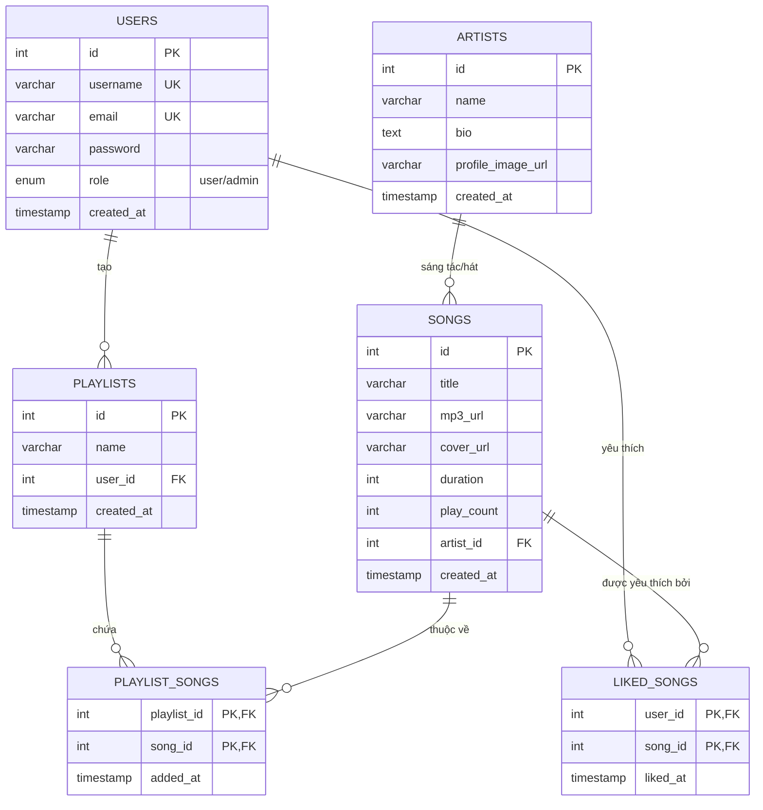

---

## 5. Danh sách API (API Endpoints)

Hệ thống cung cấp tập RESTful API hỗ trợ đầy đủ các tính năng cho Client tương tác với Server. Tất cả các danh sách trả về đều được hỗ trợ phân trang (`?page=` & `?limit=`).

### 5.1. Authentication (Xác thực)
| Method | Endpoint | Description |
|---|---|---|
| `POST` | `/api/auth/register` | Đăng ký tài khoản hệ thống |
| `POST` | `/api/auth/login` | Đăng nhập để nhận chuỗi JWT Token |
| `GET`  | `/api/auth/me` | Lấy thông tin cá nhân của phiên đăng nhập |

### 5.2. Songs (Bài hát)
| Method | Endpoint | Description |
|---|---|---|
| `GET`  | `/api/songs` | Lấy danh sách toàn bộ bài hát |
| `POST` | `/api/songs` | (Admin) Tải lên file MP3 và hình ảnh bìa |
| `GET`  | `/api/songs/search?q=...`| Tìm kiếm bài hát theo từ khóa |
| `POST` | `/api/songs/:id/play` | Tăng chỉ số lượt nghe (play_count) |
| `DELETE`| `/api/songs/:id` | (Admin) Xóa bài hát |

### 5.3. Playlists (Danh sách phát)
| Method | Endpoint | Description |
|---|---|---|
| `GET`  | `/api/playlists` | Lấy danh sách playlist của user |
| `POST` | `/api/playlists` | Khởi tạo một playlist mới |
| `PUT`  | `/api/playlists/:id` | Sửa tên playlist cá nhân |
| `POST` | `/api/playlists/:id/songs`| Thêm bài hát cụ thể vào playlist |
| `GET`  | `/api/playlists/:id/songs`| Lấy chi tiết các bài hát trong một playlist |

### 5.4. Admin & Others
| Method | Endpoint | Description |
|---|---|---|
| `GET`  | `/api/admin/stats` | Lấy chỉ số tổng quan |
| `GET`  | `/api/admin/users` | (Admin) Lấy danh sách tài khoản |
| `PUT`  | `/api/admin/users/:id/role`| (Admin) Thay đổi phân quyền thành viên |
| `GET`  | `/api/artists` | Lấy danh sách các nghệ sĩ |
| `POST` | `/api/artists` | (Admin) Thêm nghệ sĩ mới |
| `GET`  | `/api/liked` | Xem danh sách yêu thích cá nhân |
| `POST` | `/api/liked/:song_id` | Thêm vào/Xóa khỏi mục yêu thích |

---

## 6. Sequence Diagram (Biểu đồ tuần tự)

### 6.1. Luồng Xác thực (Đăng ký)
Trình tự khi người dùng tạo tài khoản mới.

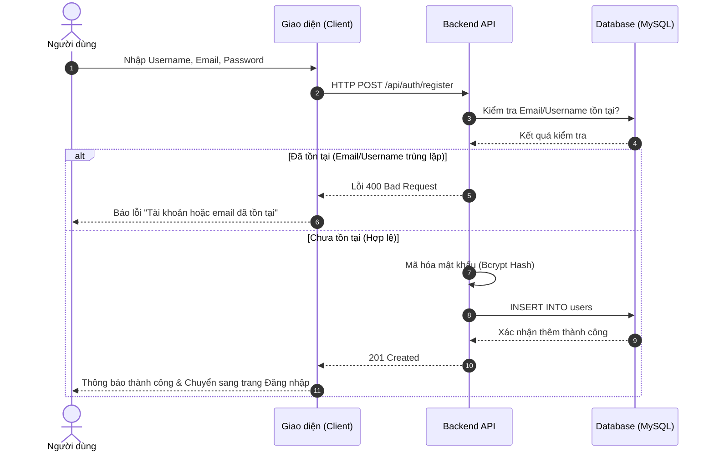

### 6.2. Luồng Xác thực (Đăng nhập)
Trình tự xác thực khi người dùng gửi yêu cầu đăng nhập.

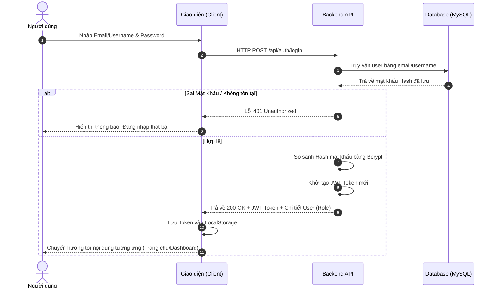

### 6.3. Luồng Phát nhạc & Tăng lượt nghe
Trình tự người dùng phát nhạc và hệ thống thống kê lượt nghe.

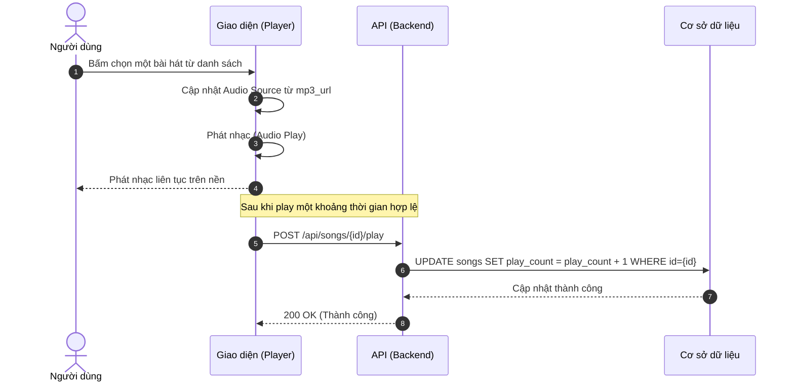

### 6.4. Luồng Tìm kiếm bài hát
Trình tự khi người dùng tìm kiếm bài hát hoặc nghệ sĩ.

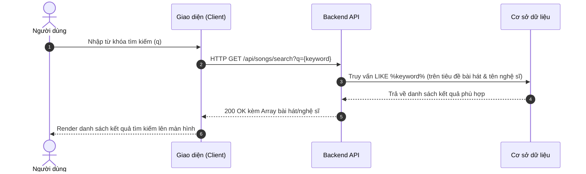

### 6.5. Luồng Thêm bài hát vào Yêu thích
Trình tự khi người dùng tương tác đánh dấu yêu thích một bản nhạc.

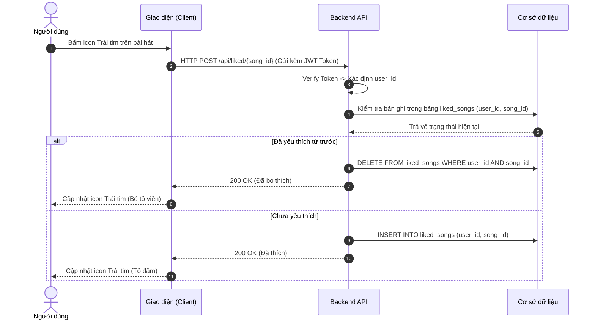

### 6.6. Luồng Quản lý Playlist (Tạo & Thêm Bài Hát)
Trình tự người dùng tạo mới Playlist và thêm bài hát vào Playlist đó.

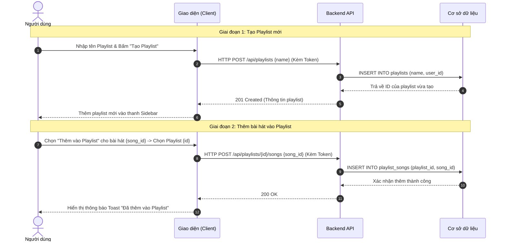

### 6.7. Luồng Quản lý Bài hát (Admin Upload Bài Hát)
Trình tự đăng tải bài hát kèm file mp3 và ảnh bìa từ Admin.

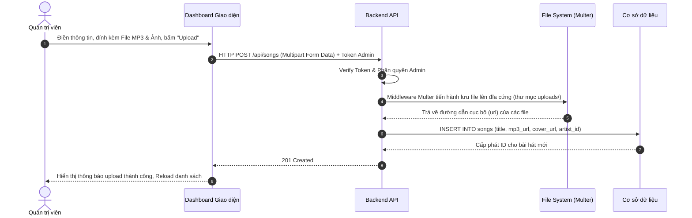

### 6.8. Luồng Quản lý Nghệ sĩ (Thêm Nghệ Sĩ)
Trình tự thêm nghệ sĩ mới vào hệ thống phục vụ việc gắn kết bài hát.

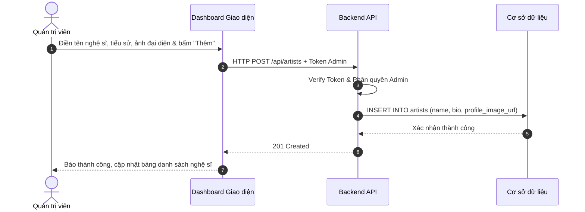

### 6.9. Luồng Quản lý Người dùng (Thay đổi Quyền/Role)
Trình tự Admin cấp quyền quản trị cho một user khác.

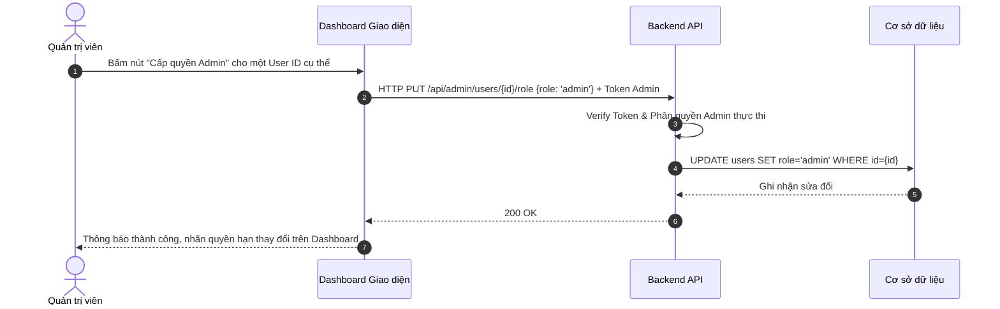

### 6.10. Luồng Xem Dashboard Thống kê
Trình tự lấy dữ liệu báo cáo thống kê cho trang Dashboard quản trị.

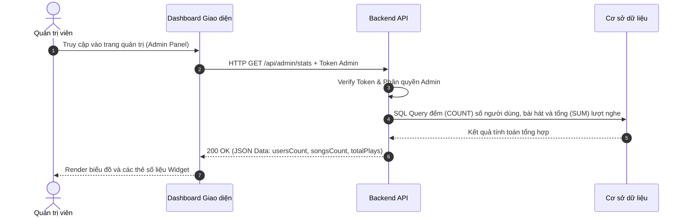

---

## 7. Tổng kết

### 7.1. Kết quả đạt được
Dự án **PTIT Music** đã hoàn thiện và đáp ứng được phần lớn các yêu cầu nghiệp vụ cốt lõi đối với một hệ thống ứng dụng Web Server hiện đại:
- **Trải nghiệm người dùng:** Giao diện được thiết kế tương tác theo xu hướng chuyên nghiệp (Giao diện Dark Mode lấy ý tưởng từ Spotify, bố cục Responsive, quản lý state phát nhạc mượt mà trên nền tảng).
- **Tính năng trọng tâm:** Trình phát nhạc ổn định (Audio Player), thao tác quản lý cá nhân hóa thư viện mượt mà (Playlist, Liked Songs) kết hợp thanh tìm kiếm thông minh từ CSDL.
- **Hỗ trợ Quản trị mạnh mẽ (Admin Dashboard):** Vận hành ổn định các thao tác thêm, sửa, xóa nội dung số (Upload file MP3 và hình ảnh chuẩn hóa), biểu đồ số liệu trực quan đảm bảo dễ kiểm soát.

### 7.2. Bài học kinh nghiệm
Sau quá trình làm đồ án, các thành viên tham gia đã tích lũy được:
- Kiến thức thực chiến với nền tảng NodeJS/ExpressJS, hiểu rõ về cơ chế RESTful API.
- Cách liên kết với cơ sở dữ liệu quan hệ mô hình RDBMS thông qua mã lệnh, thực thi các truy vấn Join phức tạp trong SQL và liên kết khóa chuẩn chỉnh.
- Quản lý định dạng Session qua cơ chế JWT (JSON Web Token), hiểu biết sâu hơn về quy trình mã hoá mật khẩu ngăn chặn lộ lọt thông tin.
- Hoàn thiện luồng kiểm thử phần mềm đơn giản trên từng chức năng bằng Postman.

### 7.3. Hướng phát triển trong tương lai
Mặc dù hệ thống đã đáp ứng được chuẩn luồng thao tác thông thường, nhóm định hướng mở rộng thêm một số module thực tiễn khác bao gồm:
1. **Gợi ý Âm nhạc (Recommendation):** Xây dựng thuật toán đề xuất gợi ý Playlist, hoặc tự động phát bài hát kế tiếp thông qua lịch sử tra cứu của User.
2. **Khôi Phục Mật khẩu (Forgot Password):** Tích hợp dịch vụ Nodemailer tự động gửi thư cấp lại mã cấp phép tới hòm mail đăng ký.
3. **Gấu Karaoke (Live Lyrics):** Cấu hình parse thêm file text định dạng chạy đồng bộ time-stamp (LRC) để lời bài hát hiển thị cùng lúc khi chạy Audio.
4. **Nền tảng thanh toán (Premium):** Triển khai phân bậc account cơ bản và quyền lợi nghe Premium (trả phí qua ngân hàng thẻ/VNPAY) chặn nghe những gói bản quyền độc nhất.

---
**Trân trọng cảm ơn Quý Thầy/Cô đã giảng dạy, định hướng và tạo điều kiện để chúng em có thể hoàn thiện đồ án Bài Tập Lớn chuyên ngành môn Lập Trình Web này!**
